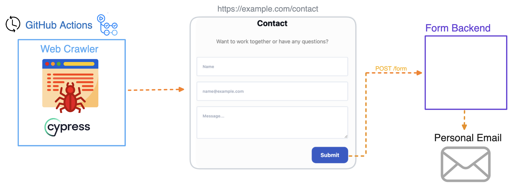

# Portfolio Site Contact Form Canary [](https://github.com/spencerlepine/portfolio-site-contact-form-canary/actions/workflows/canary.yml)

Web crawler for weekly automated form submission on my Portfolio Site Contact Form. Built with [Cypress](https://www.cypress.io/) and
[GitHub Actions](https://docs.github.com/en/actions)



## Usage

1. Update `canary.spec.js` values with your website URL, and form element `data-testid` values

```js
/**
 * Enter the data-testid for each form element (if it exists)
 *
 * <form data-testid="yeet">
 *  <input type="text" data-testid="contact-form-name-input" name="name"><br>
 *  <input type="text" data-testid="contact-form-email-input" name="email"><br>
 *  <input type="text" data-testid="contact-form-message-input" name="message"><br>
 *  <input type="submit" data-testid="contact-form-submit-btn" />
 * </form>
 */

const config = {
  contactPageUrl: 'https://mywebsite/contact',
  nameInputDataTestId: 'contact-form-name-input',
  emailInputDataTestId: 'contact-form-email-input',
  messageInputDataTestId: 'contact-form-message-input',
  submitBtnDataTestId: 'contact-form-submit-btn',
};

// ...
```

2. Configure the GitHub Actions CRON job, and let it run!

```yaml
name: Contact Form Canary

on:
  schedule:
    - cron: '0 9 * * 1' # "At 09:00 every Monday." - https://crontab.guru
  workflow_dispatch:

jobs:
  web-crawl:
    # ...
```

## Local Development

```sh
npm install
npm run headed
```

**Specifications:** `Node v20+`
